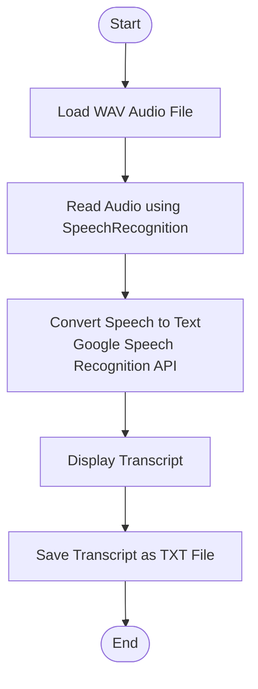

# 🎙️ Speech-to-Text Transcription


## 📖 Project Overview

Speech-to-Text Transcription is a beginner-friendly Python application that converts spoken audio into readable text.

The application reads a WAV audio file, processes the speech using the `SpeechRecognition` library, and uses the Google Speech Recognition API to obtain the transcription. The resulting text is displayed in the terminal and can also be saved to a text file.

## 🎯 Objectives

- Learn the fundamentals of speech recognition in Python.
- Convert recorded speech into text.
- Understand basic audio file processing.
- Practice Python file handling.
- Practice exception handling.
- Explore AI-powered speech recognition through an external API.

## ✨ Features

- Converts speech from an audio recording into text.
- Supports WAV audio files.
- Uses the Python `SpeechRecognition` library.
- Uses the Google Speech Recognition API.
- Displays the transcript in the terminal.
- Saves the transcript as a `.txt` file.
- Handles common recognition and file-related errors.

## 🏗️ Project Structure

```text
speech-to-text-transcription/
│
├── audio/
│   └── sample.wav
│
├── output/
│   └── transcript.txt
│
├── main.py
├── requirements.txt
├── README.md
└── .gitignore
```

## 🔄 Workflow Diagram



## 🛠️ Technologies Used

- Python 3
- SpeechRecognition
- Google Speech Recognition API
- File Handling
- Exception Handling

## ⚙️ Installation

### 1. Clone Your Repository

Replace the repository URL below with the URL of your own GitHub repository.

```bash
git clone YOUR_GITHUB_REPOSITORY_URL
```

### 2. Navigate to the Project Folder

```bash
cd speech-to-text-transcription
```

### 3. Create a Virtual Environment (Optional)

```bash
python -m venv venv
```

Activate the environment on Windows:

```bash
venv\Scripts\activate
```

### 4. Install Dependencies

```bash
pip install -r requirements.txt
```

## ▶️ Usage

1. Place a WAV audio file inside the `audio` folder.
2. Rename the audio file to:

```text
sample.wav
```

3. Run the application:

```bash
python main.py
```

4. The transcribed text will be displayed in the terminal and saved inside the `output` folder.

## 📂 Sample Output

```text
Reading audio file...
Converting speech to text...

===== Transcript =====

Hello everyone.
Welcome to my Speech-to-Text project.

Transcript saved successfully!
Location: output/transcript.txt
```

## 🔄 Project Workflow

```text
Audio Recording (.wav)
          │
          ▼
Read Audio File
          │
          ▼
SpeechRecognition Library
          │
          ▼
Google Speech Recognition API
          │
          ▼
Convert Speech into Text
          │
          ▼
Display Transcript
          │
          ▼
Save Transcript (.txt)
```

## 📚 Learning Outcomes

Through this project, I gained practical experience in:

- Speech recognition using Python.
- Basic audio file processing.
- Using external Python libraries.
- Exception handling.
- File operations.
- Working with an AI-based speech recognition API.

## 👩‍💻 Author

**Varsha Chuphal**

Aspiring AI / Python Developer

- GitHub: https://github.com/varshachuphal12/speech_to_text_translation


## ⭐ Acknowledgements

This project uses the Python `SpeechRecognition` library and the Google Speech Recognition API. Any external tutorials, repositories, or resources used while developing or learning from this project should be credited here.

---

**Note:** Update the GitHub and LinkedIn links, project screenshots, and any project-specific details before publishing the repository.
